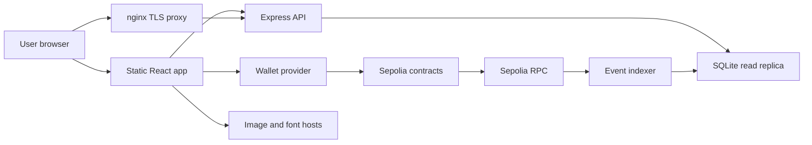

## Executive summary
- This capstone/testnet dApp has a non-custodial frontend, a public read-only Express API, a single-node SQLite read replica, and an ethers-based Sepolia indexer. The highest-risk frontend/backend themes are availability and integrity of the public read model: rate limiting is not proxy-aware, list/read endpoints have weak bounds and validation, the indexer can advance past failed event handlers, and stale/misconfigured indexer state can make the UI display incomplete chain history. Wallet addresses and transaction history are treated as public blockchain data; privacy risk is limited to easier aggregation and visitor tracking through metadata/image loads.

## Scope and assumptions
- In scope: `frontend/`, `backend/`, frontend/backend deployment guidance in `docs/deployment-gcp.md`.
- Out of scope: Solidity contract vulnerability analysis except where contracts are frontend/backend trust boundaries and event sources.
- Assumptions confirmed by user: capstone/testnet-only; deployed exactly as `docs/deployment-gcp.md`; no custody of private keys; API and wallet history are public blockchain data.
- Documentation input: ctx7 was used for current Express 4.21.2 documentation. Relevant guidance includes explicit request body parser limits, production-safe error handling, and middleware ordering.
- Open questions that would materially change risk ranking:
  - If this moves beyond capstone/testnet to real users or mainnet, frontend wallet-phishing and availability risks should be raised.
  - If wallet activity has privacy requirements beyond public chain data, `/api/nfts`, `/api/transactions`, and logs need a privacy review.

## System model
### Primary components
- Static React/Vite frontend: renders card, listing, inventory, marketplace, and royalty views; connects to MetaMask through `window.ethereum`; sends writes directly to contracts using ethers. Evidence: `frontend/src/hooks/useWallet.ts`, `frontend/src/pages/Gacha.tsx`, `frontend/src/pages/MarketplacePage.tsx`, `frontend/src/pages/Inventory.tsx`.
- Public Express API: read-only JSON API backed by Prisma/SQLite. Evidence: `backend/src/index.ts:41`, `backend/README.md`.
- Event indexer: long-running ethers process reading Sepolia events and writing the read replica. Evidence: `backend/src/indexer.ts:349`, `backend/src/indexer.ts:392`.
- SQLite database: stores public card templates, minted NFTs, listings, transactions, royalty claims, and indexer state. Evidence: `backend/prisma/schema.prisma:8`.
- nginx/GCE deployment: static frontend and `/api/` proxy to local Express; TLS via certbot. Evidence: `docs/deployment-gcp.md:240`, `docs/deployment-gcp.md:269`.
- Sepolia contracts and RPC provider: source of truth for marketplace state and event logs. Evidence: `backend/src/lib/contracts.ts:7`, `frontend/src/config/contracts.ts:21`.

### Data flows and trust boundaries
- Browser -> Static frontend: HTML, JS, CSS, fonts over HTTPS. Security guarantees: TLS in production per deployment doc; no CSP in repo. Validation: none at this boundary. Evidence: `frontend/index.html:7`, `docs/deployment-gcp.md:269`.
- Browser -> Express API: public GET requests over HTTPS via nginx `/api/` proxy. Data: wallet addresses, token IDs, filters. Security guarantees: no auth by design, permissive CORS, global rate limit, generic production errors. Validation: partial validation for rarity and integer IDs; weak validation for addresses, status, type, and pagination. Evidence: `backend/src/index.ts:21`, `backend/src/index.ts:23`, `backend/src/routes/listings.ts:11`.
- Browser -> Wallet provider -> Sepolia contracts: write transactions and read fallback calls. Data: wallet account, transaction intent, ETH value. Security guarantees: wallet confirmation and configured `CHAIN_ID`; frontend validates contract address syntax. Validation: wallet chain check in UI, contract-level authorization/value checks out of scope here. Evidence: `frontend/src/hooks/useWallet.ts:35`, `frontend/src/config/contracts.ts:8`.
- Sepolia RPC -> Indexer -> SQLite: event logs, block metadata, contract addresses. Security guarantees: configured RPC URL, event ABI parsing, single indexer lock, transaction markers for idempotence. Validation: event handlers convert log fields, but handler errors are logged and scan progress still advances. Evidence: `backend/src/indexer.ts:34`, `backend/src/indexer.ts:374`, `backend/src/indexer.ts:400`.
- Express API -> SQLite: Prisma reads only. Data: card/listing/NFT/transaction rows. Security guarantees: Prisma query construction avoids SQL injection; no raw SQL found. Validation: query-specific filters. Evidence: `backend/src/routes/nfts.ts:12`, `backend/src/routes/transactions.ts:17`.
- Frontend -> external image/font hosts: card `imageURI` values and Google Fonts. Data: visitor IP/browser metadata and page context through resource requests. Security guarantees: browser image loading semantics; React escapes text. Validation: no allowlist for image URLs; no CSP in repo. Evidence: `frontend/src/components/ui/CardArt.tsx:14`, `frontend/index.html:7`.

#### Diagram

## Assets and security objectives
| Asset | Why it matters | Security objective (C/I/A) |
|---|---|---|
| Wallet transaction intent | Users rely on UI to send ETH and NFT transactions to intended contracts | Integrity |
| Contract address configuration | Wrong addresses can route user actions to unintended contracts | Integrity |
| SQLite read replica | Drives marketplace, inventory, stats, and transaction history display | Integrity, Availability |
| Indexer cursor and event processing | Determines whether the API reflects complete chain history | Integrity, Availability |
| Public wallet/activity data | Public on-chain data, but API makes aggregation easier | Confidentiality, Integrity |
| RPC endpoint and quota | Indexer freshness depends on provider availability and rate limits | Availability |
| Static frontend bundle | Users trust it before approving wallet transactions | Integrity |
| API compute and DB resources | Public API can be exhausted by unbounded reads or collapsed rate limits | Availability |
| Build/deploy environment variables | Frontend bakes contract/API origins at build time; backend loads RPC and DB config | Integrity, Confidentiality |

## Attacker model
### Capabilities
- Remote unauthenticated internet user can call all public API endpoints.
- Remote user can connect a wallet and perform legitimate Sepolia contract actions that emit events consumed by the indexer.
- Remote user can induce frontend fallback reads by exhausting or blocking the API.
- Malicious or compromised card metadata/admin source can influence `imageURI` values rendered by the frontend.
- Dependency or static-host compromise can alter frontend code users trust before approving wallet transactions.

### Non-capabilities
- Attacker cannot force the backend to sign transactions; the backend has no signing path.
- Attacker cannot read server-side private keys through normal runtime paths; backend `.env` is local and gitignored.
- Attacker cannot mutate SQLite through API endpoints directly; the Express surface is read-only.
- Attacker cannot bypass contract-level ownership/payment checks through the frontend or backend alone.
- In capstone/testnet scope, attacker impact is limited to testnet value, demonstration integrity, and availability.

## Entry points and attack surfaces
| Surface | How reached | Trust boundary | Notes | Evidence (repo path / symbol) |
|---|---|---|---|---|
| Static frontend | HTTPS browser request | Internet -> frontend | No repo CSP/security headers; loads Google Fonts | `frontend/index.html:7` |
| Wallet connect | MetaMask injected provider | Browser -> wallet | Requires secure context and chain check | `frontend/src/hooks/useWallet.ts:35` |
| Contract writes | UI calls ethers contract methods | Browser/wallet -> Sepolia | Pack, reveal, list, buy, cancel, claim | `frontend/src/pages/Gacha.tsx:40`, `frontend/src/pages/Inventory.tsx:105` |
| API root | `GET /` | Internet -> API | Enumerates endpoints | `backend/src/index.ts:48` |
| Cards API | `GET /api/cards`, `/api/cards/:cardId`, `/rarity/:rarity` | Internet -> API -> DB | Rarity and integer validation; limited mint history | `backend/src/routes/cards.ts` |
| NFTs API | `GET /api/nfts?owner=...`, `/api/nfts/:tokenId` | Internet -> API -> DB | Owner not address-validated; owner query unbounded | `backend/src/routes/nfts.ts:8` |
| Listings API | `GET /api/listings?...`, `/api/listings/:tokenId` | Internet -> API -> DB | Status/seller unvalidated, no `take` pagination | `backend/src/routes/listings.ts:10` |
| Transactions API | `GET /api/transactions?...` | Internet -> API -> DB | `limit` parsing allows negative/NaN edge cases; type/address not allowlisted | `backend/src/routes/transactions.ts:8` |
| Health API | `GET /api/health` | Internet -> API -> DB/config | Exposes indexer block and contract addresses; rate-limit skipped | `backend/src/routes/health.ts:8`, `backend/src/index.ts:31` |
| Indexer RPC | `SEPOLIA_RPC_URL` or `SEPOLIA_RPC_WSS` | RPC -> indexer | Provider and event logs are external inputs | `backend/src/lib/contracts.ts:7` |
| Indexer lock file | `.indexer.lock` | OS/process -> indexer | Prevents duplicate local indexer processes | `backend/src/indexer.ts:30` |
| Image URLs | Card metadata rendered as `` | Contract/admin data -> browser -> external host | No URL scheme or host allowlist | `frontend/src/components/ui/CardArt.tsx:14` |

## Top abuse paths
1. API shared-bucket DoS -> attacker floods public endpoints -> Express rate limiter sees nginx IP instead of client IP -> shared bucket is exhausted -> legitimate users receive 429 or the limit is raised enough to permit heavier DB load.
2. Expensive read amplification -> attacker repeatedly calls `/api/listings?status=sold` or `/api/nfts?owner=<large-holder>` -> Prisma returns unpaginated rows with included card/NFT data -> SQLite/API CPU and memory are consumed -> marketplace/inventory becomes slow or unavailable.
3. Read-model integrity drift -> attacker or edge-case event triggers an indexer handler error -> `processLogs` logs the error and continues -> `catchUp`/`poll` saves `lastBlock` past the failed log -> API permanently omits or misstates a listing/NFT state until operator rewinds.
4. Incomplete initial sync -> operator deploys without `DEPLOY_BLOCK` or correct `addresses.deployBlock` -> indexer starts at recent fallback block -> API misses older events -> frontend shows incomplete inventory/listing/transaction state.
5. Wallet-trust compromise -> static bundle, dependency, or host is compromised -> UI presents valid-looking wallet actions against attacker-selected addresses or misleading prices -> user confirms in wallet -> contract-level safeguards may not protect against user-approved wrong intent.
6. Metadata tracking -> card `imageURI` points to attacker-controlled host -> user visits collection/marketplace -> browser loads images and leaks IP/browser referrer-like context -> attacker correlates page visits with public wallet activity.
7. RPC/WebSocket dependency exposure -> backend enables `SEPOLIA_RPC_WSS` with vulnerable transitive `ws` version -> RPC/WebSocket interaction reaches vulnerable code path -> potential memory disclosure/instability in the indexer process.

## Threat model table
| Threat ID | Threat source | Prerequisites | Threat action | Impact | Impacted assets | Existing controls (evidence) | Gaps | Recommended mitigations | Detection ideas | Likelihood | Impact severity | Priority |
|---|---|---|---|---|---|---|---|---|---|---|---|---|
| TM-001 | Remote unauthenticated user | API deployed behind nginx as documented; Express lacks `trust proxy` | Flood public API to exhaust one shared rate-limit bucket or force operators to raise limits | API unavailable or weakly limited for all users behind proxy | API compute, DB resources, frontend availability | Rate limiter enabled in `backend/src/index.ts:23`; deployment doc identifies `trust proxy` gap at `docs/deployment-gcp.md:360` | No `app.set("trust proxy", 1)` in `backend/src/index.ts`; `/api/health` skipped | Set `app.set("trust proxy", 1)` only when behind trusted nginx; configure `express-rate-limit` keying and low per-IP defaults; optionally add nginx `limit_req` | 429 rate, per-route request volume, nginx `$binary_remote_addr`, API latency | high | medium | medium |
| TM-002 | Remote unauthenticated user | Public read API, growing listing/NFT/transaction rows | Abuse unpaginated or weakly bounded queries to create DB/API load | Slower or unavailable marketplace/inventory views | API compute, SQLite, frontend availability | Some bounded reads: card mint history `take: 50`, NFT listings `take: 10`; transaction limit capped at 500 | `/api/listings` no `take`; `/api/nfts?owner` no limit; `status`, `seller`, `owner`, `type`, and negative/NaN limits are weakly validated | Add schema validation for addresses/status/type/limit; add pagination and max page size to listings/NFTs; reject negative/NaN limits; add route-specific limits | Slow query logs, response size metrics, route latency, high cardinality query patterns | medium | medium | medium |
| TM-003 | On-chain participant or operational/RPC edge case | Event handler throws for one log; indexer continues scanning | Cause or encounter a handler failure so the indexer logs error but advances `lastBlock` beyond failed event | Read replica omits or corrupts public marketplace/inventory state | SQLite read replica, indexer cursor, user trust in UI | DB writes use transactions; unique `txHash_logIndex`; errors are logged | `processLogs` catches handler errors and `saveLastBlock` still advances; no retry/dead-letter queue | Do not advance cursor when any handler fails; persist failed logs for retry; expose failed event count in health; add manual rewind command | Alert on handler error logs, failed-event table size, indexer lag vs chain tip | medium | medium | medium |
| TM-004 | Operator misconfiguration | Missing `DEPLOY_BLOCK`, missing `addresses.deployBlock`, or wrong contract address config | Start indexer from recent fallback and silently miss historical events | API history and current owner/listing state incomplete | Read replica integrity, frontend correctness | Deployment doc calls out deploy block requirement; address config validation rejects zero addresses for indexer | Fallback starts at latest minus 50,000 blocks; health only exposes last block, not completeness | Fail startup when no explicit start block in production; store deployment block in committed example or env; add sync-completeness check | Health field for `startBlock`, startup warning alerts, reconciliation against contract totals | medium | medium | medium |
| TM-005 | Dependency/RPC adversary or compromised RPC path | `ethers@6.16.0` pulls `ws@8.17.1`; backend uses `SEPOLIA_RPC_WSS` or vulnerable package remains in prod lockfile | Exercise vulnerable WebSocket dependency path | Potential indexer memory disclosure/instability; likely limited in HTTP polling mode | Indexer process, RPC interaction, dependency supply chain | `npm audit --omit=dev` detects moderate `ws` advisory; HTTP polling is default when no WSS | Lockfile contains vulnerable `ws`; fix suggested by npm is not straightforward for ethers v6 | Add npm `overrides` for `ws >= 8.20.1` if compatible, or upgrade ethers when patched; prefer HTTPS polling until fixed; rerun `npm audit` in CI | CI dependency audit, runtime indexer crashes, WSS usage inventory | low | medium | low |
| TM-006 | Malicious metadata host, compromised admin, or future user-supplied card metadata | Browser renders `imageURI` directly | Track visitors or cause mixed-content/broken-resource UX through external image loads | User IP/browser metadata exposure; weaker privacy; page degradation | Public wallet activity aggregation, frontend availability | React escapes text; images are loaded through `` not script execution | No image URL allowlist or proxy; no CSP restricting `img-src` | Allowlist HTTPS image hosts/IPFS gateways; reject `http:` and non-image schemes in card data; add CSP `img-src` and `connect-src`; consider image proxy/cache | CSP violation reports, unusual image host inventory, broken image rate | medium | low | low |
| TM-007 | Static host, dependency, or CDN compromise | Users trust frontend before wallet confirmation; no CSP in repo/deployment snippet | Inject or alter frontend JavaScript/HTML to mislead wallet actions | Users may approve transactions with wrong recipient/price/contract | Wallet transaction intent, static bundle integrity | Contract addresses are syntax-validated; wallet chain is checked | No CSP, SRI, immutable deploy integrity, or explicit security headers in nginx snippet | Add nginx CSP with `script-src 'self'`, strict `connect-src`, `img-src`, `font-src`; add frame-ancestors; host fonts locally or add SRI where feasible; add release hash verification | CSP report endpoint, file integrity monitoring, unexpected outbound `connect-src` reports | low | high | medium |
| TM-008 | Internet observer or scraper | Public API exposes health and aggregate/indexed chain data | Scrape `/api/health`, `/api/transactions`, `/api/nfts`, listings | Easier aggregation of public chain state and deployment metadata | Contract addresses, indexer status, public wallet activity | Data is public testnet/on-chain; no sensitive backend secrets returned | Health skips rate limit; no privacy controls because public by design | Keep as accepted risk for capstone; if privacy requirements change, remove address-specific history or gate API; rate-limit health by IP but allow uptime monitor | Endpoint request volume, scraper user agents, health polling spikes | medium | low | low |

## Criticality calibration
- Critical: realistic theft of private keys, backend signing ability, or pre-auth remote code execution on the deployed VM. Examples: committed real deployer private key; API endpoint executing attacker-controlled code; frontend bundle silently sending mainnet transactions to attacker contracts at scale.
- High: compromise of user transaction integrity or read-model integrity with material user harm. Examples: static bundle compromise that changes contract addresses; indexer corruption that makes users buy stale/fake listings if contracts allowed it; cross-origin script injection that manipulates wallet flows.
- Medium: public-testnet availability or integrity failures that materially disrupt demo/users but do not expose secrets or bypass contracts. Examples: proxy-collapsed rate limit DoS; unbounded listing scans exhausting SQLite; indexer advancing past failed logs.
- Low: limited metadata exposure, accepted public-chain aggregation, or dependency issues with unlikely preconditions in this deployment. Examples: public health contract address exposure; direct image URL tracking; vulnerable `ws` when WSS is not used.

## Focus paths for security review
| Path | Why it matters | Related Threat IDs |
|---|---|---|
| `backend/src/index.ts` | Express middleware order, CORS, rate limiting, proxy behavior, error handling | TM-001, TM-007, TM-008 |
| `backend/src/lib/rate-limit-config.ts` | Runtime limits can be raised high enough to weaken protection | TM-001, TM-002 |
| `backend/src/routes/listings.ts` | Public unpaginated listing query with weak `status`/`seller` validation | TM-002 |
| `backend/src/routes/nfts.ts` | Public owner query without address validation or pagination | TM-002, TM-008 |
| `backend/src/routes/transactions.ts` | Address/type/limit parsing controls public activity feed cost and privacy | TM-002, TM-008 |
| `backend/src/routes/health.ts` | Public metadata and indexer status; currently skipped by rate limiter | TM-001, TM-008 |
| `backend/src/indexer.ts` | Cursor advancement, failed-log handling, lock file, RPC batch behavior | TM-003, TM-004 |
| `backend/src/lib/contracts.ts` | RPC provider selection, WSS usage, contract binding | TM-005 |
| `backend/prisma/schema.prisma` | Indexes and relationships determine query cost and public data shape | TM-002, TM-003 |
| `frontend/src/lib/api.ts` | API base URL, fallback behavior, client-side query construction | TM-002, TM-008 |
| `frontend/src/hooks/useWallet.ts` | Wallet connection, secure-context assumptions, chain validation | TM-007 |
| `frontend/src/config/contracts.ts` | Build-time contract address and chain configuration | TM-007 |
| `frontend/src/components/ui/CardArt.tsx` | Direct rendering of metadata-controlled `imageURI` values | TM-006 |
| `frontend/index.html` | External font loads and lack of CSP/security metadata in repo | TM-006, TM-007 |
| `docs/deployment-gcp.md` | Production nginx, TLS, service model, and known hardening gaps | TM-001, TM-004, TM-007 |
| `backend/package-lock.json` | `ethers`/`ws` dependency advisory source for backend runtime | TM-005 |
| `frontend/package-lock.json` | `ethers`/`ws` advisory and frontend supply-chain hygiene | TM-005, TM-007 |

## Quality check
- Covered discovered runtime entry points: static frontend, wallet connect, contract writes, API routes, health, indexer RPC/logs, metadata image loads.
- Covered each trust boundary in at least one threat: browser/API, browser/wallet/contracts, RPC/indexer/DB, frontend/external assets, nginx/API, deployment config.
- Runtime vs CI/dev separated: contracts and CI are out of scope except as trust boundaries; dependency audit noted as runtime/supply-chain hygiene.
- User clarifications reflected: capstone/testnet-only, GCP deployment exactly as docs, wallet/activity data treated as public blockchain data.
- Assumptions and open questions are explicit; priorities are calibrated to testnet/capstone context.
